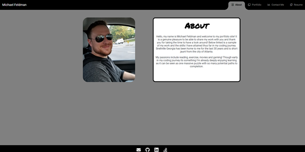
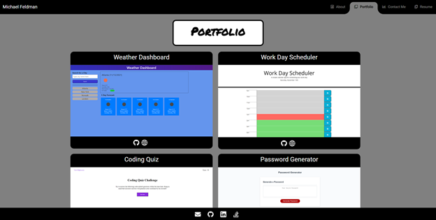
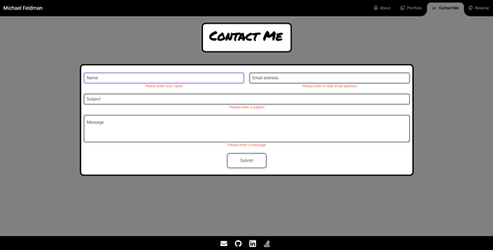
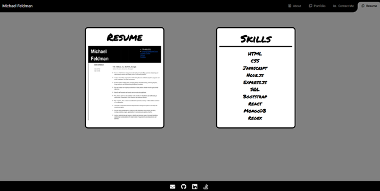

# 20-React-Portfolio

## Project Description:

This week's homework required that we create a new portfolio for our work that is to be crafted using React. This portfolio must include the sections: About Me, Porfolio (our projects), Contact and Resume. Only one section is to be loaded to the page at a time. We must include a navbar with links to all the sections and the page must load with the About Me section showing. The link on the navbar that corresponds to the currently loaded page must be highlighted.

## Technologies Used:

HTML, CSS, Javascript, React, Bootstrap, jQuery, React-hook-form, React-toastify, Email.js

## Link to application on Github:

https://github.com/micah41224/20-react-portfolio

## Link to deployed application on Heroku:

https://arcane-temple-30835.herokuapp.com/

## Screenshots of application:

## License:

The MIT License (MIT)

Copyright (c) 2021 Michael Feldman

Permission is hereby granted, free of charge, to any person obtaining a copy of this software and associated documentation files (the "Software"), to deal in the Software without restriction, including without limitation the rights to use, copy, modify, merge, publish, distribute, sublicense, and/or sell copies of the Software, and to permit persons to whom the Software is furnished to do so, subject to the following conditions:

The above copyright notice and this permission notice shall be included in all copies or substantial portions of the Software.

THE SOFTWARE IS PROVIDED "AS IS", WITHOUT WARRANTY OF ANY KIND, EXPRESS OR IMPLIED, INCLUDING BUT NOT LIMITED TO THE WARRANTIES OF MERCHANTABILITY, FITNESS FOR A PARTICULAR PURPOSE AND NONINFRINGEMENT. IN NO EVENT SHALL THE AUTHORS OR COPYRIGHT HOLDERS BE LIABLE FOR ANY CLAIM, DAMAGES OR OTHER LIABILITY, WHETHER IN AN ACTION OF CONTRACT, TORT OR OTHERWISE, ARISING FROM, OUT OF OR IN CONNECTION WITH THE SOFTWARE OR THE USE OR OTHER DEALINGS IN THE SOFTWARE.

## Contact Information:

Developer - Michael Feldman

Email - micah41224@gmail.com
